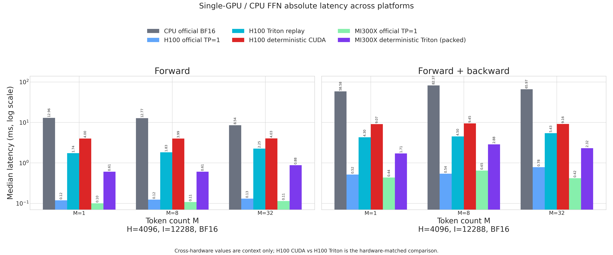
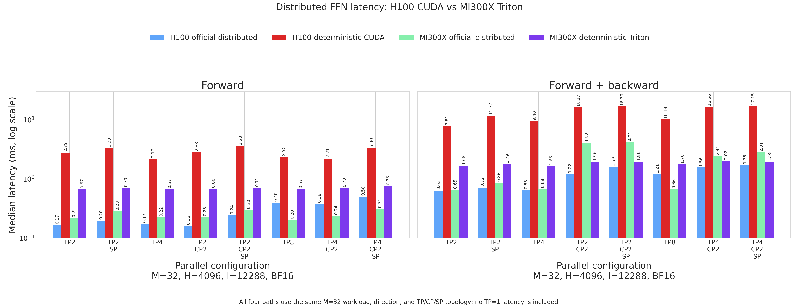

# PR #325 ROCm deterministic Triton FFN report

This is an operator-only MI300X report. It does not load or benchmark a model checkpoint.

## Comparison contract

1. **Determinism:** every Triton TP/CP/SP result is compared bitwise with the same deterministic Triton FFN at **TP=1**. The reported metric is element mismatch count; acceptance requires 0.
2. **FP16/FP32:** one separate, simple output comparison runs official Hugging Face `Qwen3MLP` at TP=1 in FP16 and FP32. FP32 is the reference.
3. **Speed:** single-GPU speed retains the official Qwen3MLP TP=1 context. Distributed speed compares four same-topology paths: H100 official/deterministic and MI300X official/deterministic.

## Environment

This table describes the MI300X distributed rerun. The preserved single-GPU
and dtype observations come from `caef501101a3906c733076f31f3b5a9870169d16`
with Transformers 5.10.4; their values and figures are unchanged. Per-series
provenance is recorded in `results.json:measurement_sources`.

| Field | Value |
|---|---|
| NCCL_IB_DISABLE | 1 |
| architecture | gfx942:sramecc+:xnack- |
| deterministic_compute | ROCm-native Triton |
| deterministic_transport | fixed-tree HIP IPC with RCCL fallback on ROCm |
| distributed_speed_comparison | four same-topology H100/MI300X paths |
| git_commit | 98dcd38fb635e1e0eab9035aa4c4b40483cc36b8 |
| gpu | AMD Instinct MI300X |
| gpu_count | 8 |
| hip | 7.14.60850 |
| python | 3.12.3 |
| single_gpu_speed_context | Hugging Face Transformers Qwen3MLP, TP=1 |
| torch | 2.12.0+rocm7.14.0a20260608 |
| transformers | 5.13.1 |

## Methodology

- Operator shape: H=4096, I=12288; BF16 is used for all speed and determinism measurements.
- Single-GPU shapes use M=1/8/32. Distributed cases use the same full logical M=32 input for TP2/4/8, TP+CP, and sequence parallelism.
- The distributed comparison joins rows by topology and direction: H100 and MI300X use the same logical M=32 workload and TP/CP/SP layout. Official TP=1 latency is neither collected nor used in that distributed ratio.
- MI300X official distributed uses upstream Qwen3 FFN math with native PyTorch BF16 GEMMs and native RCCL collectives over the same shards; the deterministic path uses the current Triton FFN and fixed-order transport.
- Deterministic Triton timings use the explicit prepacked forward-weight cache. Packing happens once outside the timed region; canonical source weights remain the autograd and optimizer source of truth.
- The TP=1 cache adds 288 MiB; each TP rank holds that amount divided by TP size. Refresh cost is excluded because the benchmark measures the steady-state FFN call.
- The distributed exactness baseline is the PR's deterministic Triton FFN at TP=1. Local outputs, dHidden, and sharded dWeights are compared against their exact TP=1 slices.
- Communication contract for TP+CP+SP: forward uses 1 TP AllGather plus 1 TP ReduceScatter (2 calls). Forward+backward retains 7 AllGathers plus 3 logical ReduceScatter lanes; PR #357 merges the two independent backward gate/up lanes into one `reduce_scatter_many` call, for 9 collective invocations.
- Implementation note: the current ROCm deterministic communication operator is adopted from PR #357. This changes the implementation under test, not the benchmark comparison contract.
- Single-GPU timing: GPU events, median and p95; distributed timing: synchronized wall clock, slowest rank/sample.
- Distributed workers: one NUMA-local CPU per GPU rank to reduce host-scheduler noise in synchronized wall-clock samples.
- MI300X distributed: 10 forward warmups and 50 forward samples; the script halves the training warmup to 5, followed by 20 forward+backward samples.
- H100 official distributed: user-supplied measurements at `98dcd38fb635e1e0eab9035aa4c4b40483cc36b8`, NVIDIA H100 80GB, PyTorch 2.13.0+cu130 / CUDA 13.0. All world sizes use 5 warmups, 20 forward samples, and 10 forward+backward samples. Shape, BF16 dtype, topology, and synchronized slowest-rank wall-clock timing match the ROCm run. Sample counts differ; p95, particularly with 10 training samples, should be interpreted cautiously.
- H100 official uses same-topology `F.linear` + NCCL. The submitted settings include `NCCL_NVLS_ENABLE=0`, `NCCL_IB_DISABLE=1`, and `RL_KERNEL_DET_GEMM_BACKEND=sm90`. Commands are retained in `cuda_cpu_comparison.json:source.official_h100_update`. The user discarded H100 10/50/20 reruns affected by competing workloads on GPUs 0–3.
- H100 CUDA values remain the historical measurements at `8576fa4bf449734ae99e9b50be8756bb282a8916`, as requested. The four plotted series do not all come from one commit or sampling configuration. Ratios below are recomputed from the displayed columns; they are not the ratios in the newly supplied CUDA tables and do not isolate the cost of determinism in a controlled same-commit experiment.
- The MI300X server was shared: another process held about 180 GiB on GPU 7. All layouts completed successfully, but the results are not exclusive-node measurements.
- `NCCL_IB_DISABLE=1` keeps the distributed run on intra-node XGMI. Median, p95, min, and max values are available in `results.json`.

Reproduce the ROCm measurement from commit `98dcd38` into a separate output directory:

```bash
NCCL_IB_DISABLE=1 OMP_NUM_THREADS=1 python benchmarks/benchmark_rocm_ffn.py \
  --warmup 10 \
  --samples 50 \
  --training-samples 20 \
  --output-dir benchmarks/results/pr325_rocm_mi300x_reproduction
```

This combined artifact preserves historical single-GPU and H100 CUDA data;
a new benchmark run alone does not recreate those historical sections.
Regenerate the figures directly from the synchronized JSON, without rerunning
measurements:

```bash
python - <<'PY'
import json
import runpy
from pathlib import Path

directory = Path("benchmarks/results/pr325_rocm_mi300x")
benchmark = runpy.run_path("benchmarks/benchmark_rocm_ffn.py")
benchmark["_write_figures"](
    json.loads((directory / "results.json").read_text()),
    directory,
    json.loads((directory / "cuda_cpu_comparison.json").read_text()),
)
PY
```

## Results summary

- TP=1 exactness baseline: **0 mismatched elements** across topology forward outputs, training outputs, dHidden, and dWeights.
- Repeat mismatch: **0**; training/inference forward mismatch: **0**.
- Single-GPU deterministic Triton packed-cache latency is **3.92-7.64x** the official Qwen3MLP TP=1 latency across M=1/8/32 and forward/training.
- MI300X deterministic Triton latency is **0.12-0.32x** the H100 deterministic CUDA latency for the same distributed layouts. Both official distributed paths are reported alongside them.
- Versus the historical MI300X timings embedded in the script, this rerun is faster in **16/16** rows, with a mean latency reduction of **36.1%**. This is historical context, not a controlled attribution to PR #357.
- The separate official-Qwen3MLP FP16 versus FP32 observation has relative-L2 error **6.544e-04** for (M,H,I)=(8,4096,12288).

## Single-GPU FFN speed

Performance only; no official-versus-Triton accuracy metric is reported here.

| Shape / direction | Official Qwen3MLP TP=1 (ms) | Deterministic Triton, packed (ms) | Triton / official TP=1 |
|---|---:|---:|---:|
| (M,H,I)=(1,4096,12288), forward | 0.1004 | 0.6053 | 6.03x |
| (M,H,I)=(1,4096,12288), forward+backward | 0.4371 | 1.7138 | 3.92x |
| (M,H,I)=(8,4096,12288), forward | 0.1077 | 0.6054 | 5.62x |
| (M,H,I)=(8,4096,12288), forward+backward | 0.6476 | 2.8767 | 4.44x |
| (M,H,I)=(32,4096,12288), forward | 0.1146 | 0.8761 | 7.64x |
| (M,H,I)=(32,4096,12288), forward+backward | 0.4182 | 2.3188 | 5.54x |

## Distributed FFN speed

Every row compares the same distributed topology and direction. No TP=1 latency is used in this table.

| Parallel layout | Direction | H100 official distributed (ms) | H100 deterministic CUDA (ms) | MI300X official distributed (ms) | MI300X deterministic Triton (ms) | H100 det / official | MI300X det / official |
|---|---|---:|---:|---:|---:|---:|---:|
| tp2 | forward | 0.1653 | 2.7896 | 0.2164 | 0.6669 | 16.88x | 3.08x |
| tp2 | train_fwd_bwd | 0.6347 | 7.8125 | 0.6532 | 1.6757 | 12.31x | 2.57x |
| tp2_sp | forward | 0.1974 | 3.3310 | 0.2825 | 0.7038 | 16.87x | 2.49x |
| tp2_sp | train_fwd_bwd | 0.7162 | 11.7695 | 0.8634 | 1.7942 | 16.43x | 2.08x |
| tp4 | forward | 0.1742 | 2.1687 | 0.2240 | 0.6677 | 12.45x | 2.98x |
| tp4 | train_fwd_bwd | 0.6460 | 9.3954 | 0.6778 | 1.6612 | 14.54x | 2.45x |
| tp2_cp2 | forward | 0.1600 | 2.8261 | 0.2261 | 0.6825 | 17.66x | 3.02x |
| tp2_cp2 | train_fwd_bwd | 1.2175 | 16.1722 | 4.0314 | 1.9632 | 13.28x | 0.49x |
| tp2_cp2_sp | forward | 0.2425 | 3.5814 | 0.2989 | 0.7069 | 14.77x | 2.36x |
| tp2_cp2_sp | train_fwd_bwd | 1.5878 | 16.7894 | 4.2115 | 1.9622 | 10.57x | 0.47x |
| tp8 | forward | 0.3962 | 2.3206 | 0.2006 | 0.6680 | 5.86x | 3.33x |
| tp8 | train_fwd_bwd | 1.2062 | 10.1375 | 0.6640 | 1.7631 | 8.40x | 2.66x |
| tp4_cp2 | forward | 0.3806 | 2.2141 | 0.2377 | 0.6979 | 5.82x | 2.94x |
| tp4_cp2 | train_fwd_bwd | 1.5640 | 16.5617 | 2.4378 | 2.0162 | 10.59x | 0.83x |
| tp4_cp2_sp | forward | 0.5009 | 3.2972 | 0.3100 | 0.7566 | 6.58x | 2.44x |
| tp4_cp2_sp | train_fwd_bwd | 1.7319 | 17.1457 | 2.8061 | 1.9804 | 9.90x | 0.71x |

### H100 official timing distributions

User-supplied values in milliseconds, retained at their supplied precision. The chart uses the median column.

| Parallel layout | Direction | Median | p95 | Min | Max |
|---|---|---:|---:|---:|---:|
| tp2 | forward | 0.1653 | 0.2055 | 0.1420 | 0.3013 |
| tp2 | train_fwd_bwd | 0.6347 | 0.6955 | 0.5826 | 0.6997 |
| tp2_sp | forward | 0.1974 | 0.2161 | 0.1807 | 0.2273 |
| tp2_sp | train_fwd_bwd | 0.7162 | 1.0543 | 0.6713 | 1.2747 |
| tp4 | forward | 0.1742 | 0.8594 | 0.1545 | 1.4339 |
| tp4 | train_fwd_bwd | 0.6460 | 0.7029 | 0.5959 | 0.7232 |
| tp2_cp2 | forward | 0.1600 | 0.8807 | 0.1411 | 1.4457 |
| tp2_cp2 | train_fwd_bwd | 1.2175 | 2.2282 | 1.1868 | 2.2589 |
| tp2_cp2_sp | forward | 0.2425 | 0.2821 | 0.2271 | 0.3538 |
| tp2_cp2_sp | train_fwd_bwd | 1.5878 | 1.6838 | 1.4295 | 1.7189 |
| tp8 | forward | 0.3962 | 1.1780 | 0.3521 | 1.2054 |
| tp8 | train_fwd_bwd | 1.2062 | 1.4400 | 1.1445 | 1.4588 |
| tp4_cp2 | forward | 0.3806 | 1.4873 | 0.3540 | 2.5012 |
| tp4_cp2 | train_fwd_bwd | 1.5640 | 2.7782 | 1.4680 | 2.9183 |
| tp4_cp2_sp | forward | 0.5009 | 0.5523 | 0.4745 | 0.5670 |
| tp4_cp2_sp | train_fwd_bwd | 1.7319 | 1.9220 | 1.7104 | 1.9283 |

The same statistics are embedded in `results.json:distributed_platform_comparison.rows[].h100_official_distributed_summary_ms`. MI300X median/p95/min/max are in `results.json:distributed_ffn[]` under `official_distributed` and `triton`.

### Historical MI300X latency context

The previous values are constants from an older benchmark; they were not rerun
in this session. Implementation and run conditions differ, so these changes
cannot be attributed solely to PR #357. They are not included as another series
in the main figure.

| Parallel layout | Direction | Previous (ms) | Current (ms) | Latency reduction |
|---|---|---:|---:|---:|
| tp2 | forward | 0.9040 | 0.6669 | 26.2% |
| tp2 | train_fwd_bwd | 2.6997 | 1.6757 | 37.9% |
| tp2_sp | forward | 1.0561 | 0.7038 | 33.4% |
| tp2_sp | train_fwd_bwd | 2.9646 | 1.7942 | 39.5% |
| tp4 | forward | 0.8359 | 0.6677 | 20.1% |
| tp4 | train_fwd_bwd | 2.6999 | 1.6612 | 38.5% |
| tp2_cp2 | forward | 0.9016 | 0.6825 | 24.3% |
| tp2_cp2 | train_fwd_bwd | 3.5606 | 1.9632 | 44.9% |
| tp2_cp2_sp | forward | 1.1296 | 0.7069 | 37.4% |
| tp2_cp2_sp | train_fwd_bwd | 3.9929 | 1.9622 | 50.9% |
| tp8 | forward | 1.0860 | 0.6680 | 38.5% |
| tp8 | train_fwd_bwd | 2.5620 | 1.7631 | 31.2% |
| tp4_cp2 | forward | 1.0536 | 0.6979 | 33.8% |
| tp4_cp2 | train_fwd_bwd | 3.2599 | 2.0162 | 38.2% |
| tp4_cp2_sp | forward | 1.1928 | 0.7566 | 36.6% |
| tp4_cp2_sp | train_fwd_bwd | 3.7498 | 1.9804 | 47.2% |

## CUDA GPU and CPU performance context

The additional measurements come from [PR #321 deterministic CUDA FFN performance report](https://github.com/RL-Align/RL-Kernel/pull/321) at CUDA commit `8576fa4bf449734ae99e9b50be8756bb282a8916`. H100 Triton replays use this PR's code at `e64abab904880b877d26d04c0cfad020b992aa51`.

The same-H100 CUDA/Triton ratio is the hardware-matched comparison. CPU and MI300X columns provide absolute-latency context only; they are not hardware-normalized speed claims.

| Comparison environment | Value |
|---|---|
| CUDA GPU | NVIDIA H100 80GB HBM3 (sm_90) |
| CUDA / PyTorch | 13.0 / 2.13.0+cu130 |
| CPU | Intel(R) Xeon(R) Platinum 8468, 96 intra-op threads |
| Transformers | 5.13.1 |

### Single-GPU and CPU absolute latency

| Shape / direction | CPU official (ms) | H100 official TP=1 (ms) | H100 Triton replay (ms) | H100 CUDA (ms) | CUDA / Triton H100 | MI300X official TP=1 (ms) | MI300X Triton (ms) |
|---|---:|---:|---:|---:|---:|---:|---:|
| M=1, forward | 12.9558 | 0.1193 | 1.7381 | 3.9988 | 2.30x | 0.1004 | 0.6053 |
| M=1, forward+backward | 58.5765 | 0.5184 | 4.2997 | 9.0704 | 2.11x | 0.4371 | 1.7138 |
| M=8, forward | 12.7676 | 0.1239 | 1.8293 | 3.9923 | 2.18x | 0.1077 | 0.6054 |
| M=8, forward+backward | 82.3669 | 0.5414 | 4.5028 | 9.4500 | 2.10x | 0.6476 | 2.8767 |
| M=32, forward | 8.5392 | 0.1311 | 2.2529 | 4.0277 | 1.79x | 0.1146 | 0.8761 |
| M=32, forward+backward | 65.9689 | 0.7842 | 5.4261 | 9.1635 | 1.69x | 0.4182 | 2.3188 |

The main distributed table combines the updated user-supplied H100 official
measurements with preserved historical H100 CUDA measurements, joined to the
MI300X rerun by topology and direction. TP=1 latency is excluded from all four
columns. The single-GPU/CPU table above retains its original measurements.

## Topology exactness versus Triton TP=1

All columns are element mismatch counts. This table does not compare against the official FFN.

| Parallel layout | Forward output | Training output | dHidden | dWeights | Repeat | Train/infer |
|---|---:|---:|---:|---:|---:|---:|
| tp2 | 0 | 0 | 0 | 0 | 0 | 0 |
| tp2_sp | 0 | 0 | 0 | 0 | 0 | 0 |
| tp4 | 0 | 0 | 0 | 0 | 0 | 0 |
| tp2_cp2 | 0 | 0 | 0 | 0 | 0 | 0 |
| tp2_cp2_sp | 0 | 0 | 0 | 0 | 0 | 0 |
| tp8 | 0 | 0 | 0 | 0 | 0 | 0 |
| tp4_cp2 | 0 | 0 | 0 | 0 | 0 | 0 |
| tp4_cp2_sp | 0 | 0 | 0 | 0 | 0 | 0 |

## Simple FP16 versus FP32 observation

This is an official `Qwen3MLP` TP=1 output comparison only; it is not used to judge deterministic Triton and is not included in speed ratios.

| Shape | Candidate | Reference | Max abs | Mean abs | Relative L2 |
|---|---|---|---:|---:|---:|
| (M,H,I)=(8,4096,12288) | FP16 | FP32 | 2.046e-06 | 3.742e-07 | 6.544e-04 |

## Deterministic communication overlap

The current timing includes the fixed-order communication schedule and makes no overlap claim. Forward SP all-gather must finish before gate/up projection, and TP reduction consumes the down-projection output, so those edges are hard dependencies.

In backward, the gate and up contributions to dHidden are independent until their final ordered addition. A future implementation can place the fixed-rank reduction of one contribution on a second stream while computing the other, but it must preserve rank order, reduction tree, wait points, and gate-then-up addition order. Any optimization is accepted only if every TP=1 mismatch column remains zero.

## Figures





