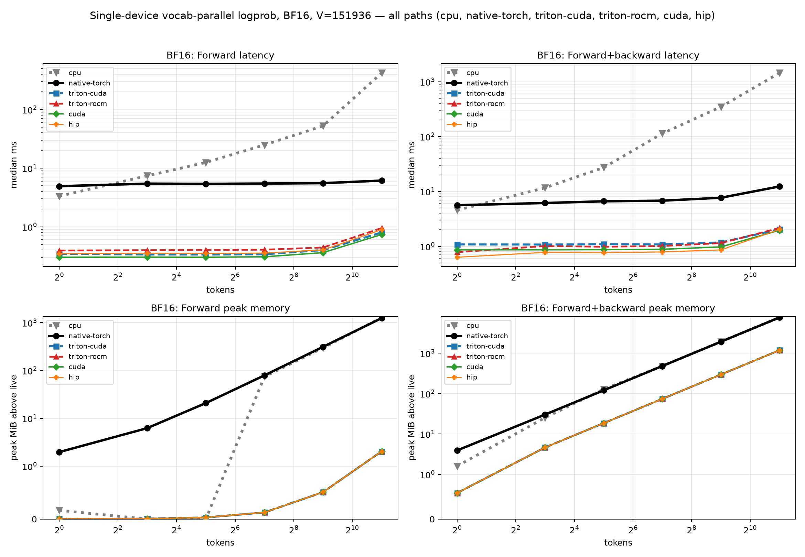
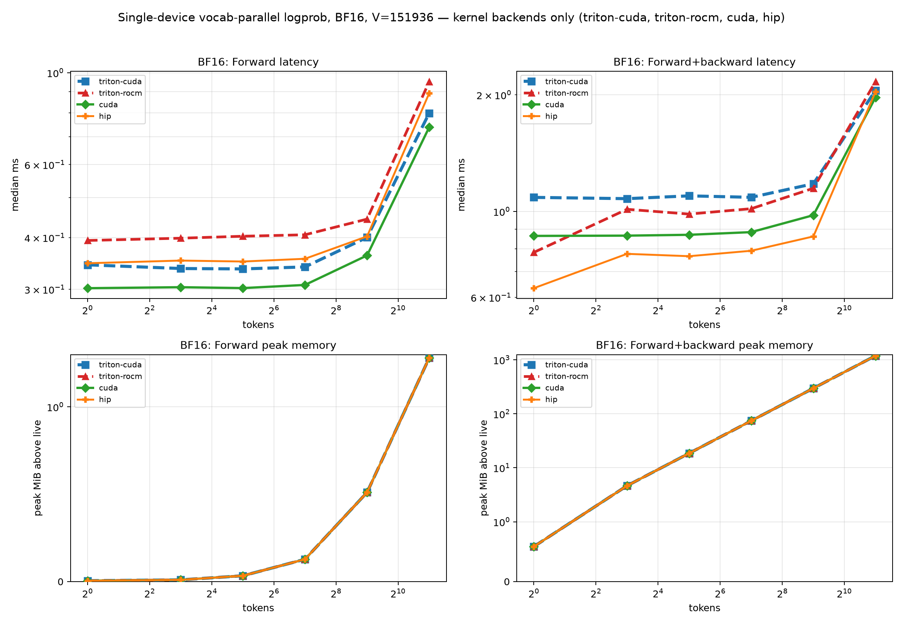
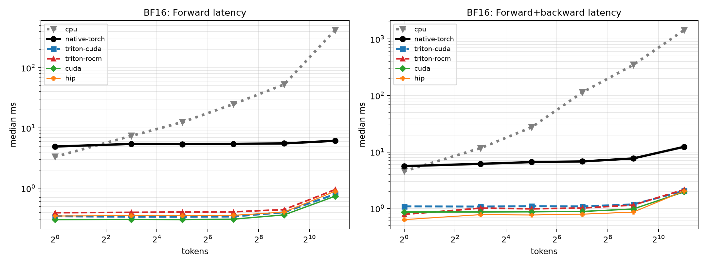
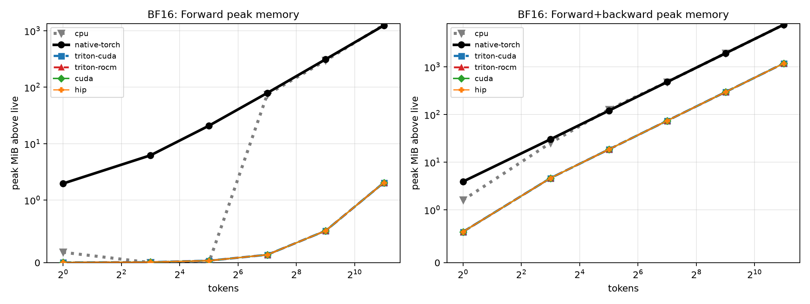
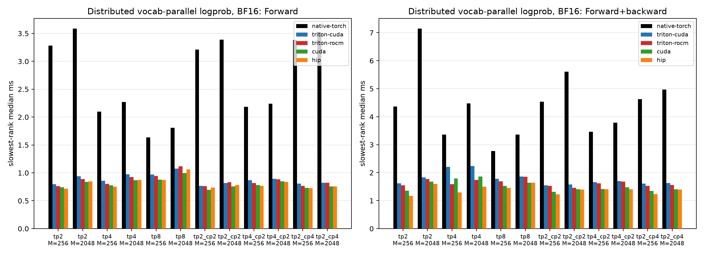

# PR #328 vocab-parallel logprob performance analysis

> Operator-only benchmark. No model checkpoint or serving engine was used.

> Every platform below ran this same harness, so the seeded logits, the `V=151936` / 64-tile split, and the FP64 oracle are identical and only the device and backend differ. Backends are not available everywhere: `ws2-rocm` is ROCm-only, `ws2-cuda` is CUDA-only, `ws2-triton` compiles from one source on both, and the PyTorch paths are the only ones that also run on the host. A missing row means the backend cannot exist on that platform, not that it failed.

## Environment

| Item | mi300x | h100 | cpu |
|---|---|---|---|
| architecture | gfx942:sramecc+:xnack- | sm_90 | x86_64 |
| cpu_count | n/a | n/a | 192 |
| cuda | n/a | 13.0 | 13.0 |
| device | n/a | cuda | cpu |
| extension_symbols | hip_deterministic_logp_tile_stats, hip_deterministic_logp_backward | deterministic_logp_tile_stats | deterministic_logp_tile_stats |
| git_commit | e9f1d2a5c67a283bd987978614b4444a9416c1f0 | dd5fe05be2252e04b0308149b46ac783bd68e42a | dd5fe05be2252e04b0308149b46ac783bd68e42a |
| gpu | AMD Instinct MI300X | NVIDIA H100 80GB HBM3 | n/a (host execution) |
| gpu_count | 8 | 8 | 0 |
| hip | 7.14.60850 | None | None |
| native_collective | torch.distributed ProcessGroupNCCL (RCCL on ROCm) | torch.distributed ProcessGroupNCCL (NCCL) | n/a (single-process host run) |
| python | 3.12.3 | 3.11.15 | 3.11.15 |
| torch | 2.12.0+rocm7.14.0a20260608 | 2.13.0+cu130 | 2.13.0+cu130 |
| torch_threads | n/a | n/a | 96 |

## Methodology

- Qwen3 vocabulary `V=151936` split into 64 tiles of 2374 columns; seeded logits (`randn * 2.0`), random targets, every seventh token inactive.
- Measured paths:
  - `native`: `pytorch-vocab-parallel-logp-ws2`, the WS2 vocab-parallel reference operator: a PyTorch tile loop for the per-tile FP32 `(max, sumexp)` partials, all-gather of the partials, fixed global tile-order merge, and a PyTorch autograd backward.
  - `triton`: `triton-vocab-parallel-logp-ws2`, the same contract, transport, and merge with two Triton kernels (tile statistics read from the stored shard, fused backward); one source for CUDA and ROCm.
  - `cuda`: `cuda-vocab-parallel-logp-ws2`, the same contract, transport, and merge with two CUDA kernels from `csrc/deterministic_logp_kernel.cu`: `deterministic_logp_tile_stats` reads the stored BF16/FP16/FP32 shard directly (16-byte vector loads, no FP32 copy) and `deterministic_logp_backward` produces the gradient in one fused pass.
  - `hip`: `rocm-vocab-parallel-logp-ws2`, the same contract, transport, and merge with two HIP kernels: `hip_deterministic_logp_tile_stats` reads the stored BF16/FP16/FP32 shard directly (8-element vector loads, no FP32 copy) and `hip_deterministic_logp_backward` produces the gradient in one fused pass.
- Distributed: one process per GPU; the WS2 operators all-gather per-tile `(max, sumexp)` partials over NCCL/RCCL and merge them in fixed global tile order; CP ranks shard tokens and never enter the merge.
- Forward returns the selected-token logprob and the vocabulary LSE; forward+backward computes `grad_logits` for `sum(active * logp)`. The WS2 operators run with `validate=False`; the `validate=True` production entry point is measured separately.
- Single-GPU timing: GPU events, median and p95. Distributed timing: synchronized wall clock, slowest rank per sample. Peak memory is the per-call increase in `torch.cuda.max_memory_allocated` (distributed: max over ranks).
- Accuracy is against an FP64 `logsumexp` of the same (BF16-rounded) logits. Repeat = two identical calls are bitwise equal; batch-invariant = a row computed alone is bitwise equal to the same row inside the batch; TP-replicated = every TP rank holds identical bits.
- 5 warmups, 20 measured forward samples, 10 measured forward+backward samples. Raw medians, p95, minimum, maximum, and every measured path are in `results.json`.
- Tables show 2048 tokens; the figures cover the full token sweep.

Reproduce this report from the repository root:

```bash
python benchmarks/benchmark_rocm_logp.py \
  --warmup 5 \
  --samples 20 \
  --training-samples 10 \
  --report-paths ws2-reference,ws2-triton,ws2-cuda,ws2-rocm \
  --rename ws2-reference=native,ws2-triton=triton,ws2-cuda=cuda,ws2-rocm=hip \
  --report-baseline ws2-reference \
  --table-tokens 2048 \
  --compare-with h100=benchmarks/results/pr328_cuda_h100/results.json \
  --compare-with cpu=benchmarks/results/pr328_cpu/results.json \
  --compare-label mi300x \
  --output-dir benchmarks/results/pr328_rocm_mi300x
```

## Key findings

- mi300x Single GPU: `triton` is 5.26-6.45x faster than `native` in forward and 4.29-5.71x in forward+backward, with 0.15-0.33x its peak memory.
- mi300x Distributed: `triton` is 1.62-4.28x faster than `native` in forward and 1.82-4.05x in forward+backward across 6 TP/CP topologies, at 0.15x the per-rank peak memory (absolute forward 0.824-1.115 ms).
- mi300x Single GPU: `hip` is 5.59-6.88x faster than `native` in forward and 4.47-6.07x in forward+backward, with 0.15-0.33x its peak memory.
- mi300x Distributed: `hip` is 1.70-4.67x faster than `native` in forward and 2.05-4.49x in forward+backward across 6 TP/CP topologies, at 0.15x the per-rank peak memory (absolute forward 0.755-1.063 ms).
- mi300x The `hip_deterministic_logp_tile_stats` kernel alone is 9.6-9.9x faster than the PyTorch tile loop and allocates 57x less transient memory (it writes only the `[tokens, 64]` FP32 partials).
- mi300x `triton` vs `native`: tile maxima are bitwise equal; sumexp partials differ only by FP32 summation order, so final outputs differ in 0-169 elements per case with relative-L2 0.0e+00-6.9e-08. Both paths are equally close to FP64.
- mi300x `hip` vs `native`: tile maxima are bitwise equal; sumexp partials differ only by FP32 summation order, so final outputs differ in 0-65 elements per case with relative-L2 0.0e+00-1.3e-08. Both paths are equally close to FP64.
- mi300x Repeat bitwise: yes; batch-invariant: yes; all gradients finite: yes.
- mi300x Distributed: TP-replicated and repeat bitwise on every topology: yes.
- h100 Single GPU: `triton` is 6.80-8.83x faster than `native` in forward and 5.28-8.12x in forward+backward, with 0.15-0.33x its peak memory.
- h100 Distributed: `triton` is 1.74-4.33x faster than `native` in forward and 2.13-5.02x in forward+backward across 6 TP/CP topologies, at 0.15x the per-rank peak memory (absolute forward 0.817-1.077 ms).
- h100 Single GPU: `cuda` is 6.98-9.55x faster than `native` in forward and 5.49-8.46x in forward+backward, with 0.15-0.33x its peak memory.
- h100 Distributed: `cuda` is 1.89-4.75x faster than `native` in forward and 2.41-5.48x in forward+backward across 6 TP/CP topologies, at 0.15x the per-rank peak memory (absolute forward 0.756-0.995 ms).
- h100 The `deterministic_logp_tile_stats` kernel alone is 10.5-10.6x faster than the PyTorch tile loop and allocates 57x less transient memory (it writes only the `[tokens, 64]` FP32 partials).
- h100 `triton` vs `native`: tile maxima are bitwise equal; sumexp partials differ only by FP32 summation order, so final outputs differ in 0-81 elements per case with relative-L2 0.0e+00-6.9e-08. Both paths are equally close to FP64.
- h100 `cuda` vs `native`: tile maxima are bitwise equal; sumexp partials differ only by FP32 summation order, so final outputs differ in 0-73 elements per case with relative-L2 0.0e+00-1.3e-08. Both paths are equally close to FP64.
- h100 Repeat bitwise: yes; batch-invariant: yes; all gradients finite: yes.
- h100 Distributed: TP-replicated and repeat bitwise on every topology: yes.
- cpu Repeat bitwise: yes; batch-invariant: yes; all gradients finite: yes.

## Single-GPU logprob (BF16 logits, V=151936)

### Forward

| Tokens | Platform | Path | Median (ms) | p95 (ms) | Speedup vs native | Peak MiB | logp max-abs vs FP64 | LSE max-abs vs FP64 | Repeat | Batch-inv |
|---:|---|---|---:|---:|---:|---:|---:|---:|:---:|:---:|
| 2048 | mi300x | native | 6.1387 | 6.3072 | 1.00× | 1245.0 | 1.557e-06 | 1.382e-06 | yes | yes |
| 2048 | mi300x | triton | 0.9514 | 0.9801 | 6.45× | 2.0 | 1.557e-06 | 1.318e-06 | yes | yes |
| 2048 | mi300x | hip | 0.8923 | 0.9162 | 6.88× | 2.0 | 1.621e-06 | 1.318e-06 | yes | yes |
| 2048 | h100 | native | 7.0518 | 7.0676 | 1.00× | 1246.0 | 1.225e-06 | 8.285e-07 | yes | yes |
| 2048 | h100 | triton | 0.7990 | 0.8314 | 8.83× | 2.0 | 1.225e-06 | 8.285e-07 | yes | yes |
| 2048 | h100 | cuda | 0.7388 | 0.7532 | 9.55× | 2.0 | 1.225e-06 | 8.285e-07 | yes | yes |
| 2048 | cpu | native | 421.5963 | 430.5902 | 1.00× | 1277.0 | 1.245e-06 | 8.234e-07 | yes | yes |

### Forward+backward

| Tokens | Platform | Path | Median (ms) | p95 (ms) | Speedup vs native | Peak MiB | Memory vs native | Grad finite |
|---:|---|---|---:|---:|---:|---:|---:|:---:|
| 2048 | mi300x | native | 12.3477 | 12.4680 | 1.00× | 7715.7 | 1.00× | yes |
| 2048 | mi300x | triton | 2.1619 | 2.1945 | 5.71× | 1187.1 | 0.15× | yes |
| 2048 | mi300x | hip | 2.0359 | 2.0513 | 6.07× | 1187.1 | 0.15× | yes |
| 2048 | h100 | native | 16.6661 | 16.8009 | 1.00× | 7722.7 | 1.00× | yes |
| 2048 | h100 | triton | 2.0525 | 2.1072 | 8.12× | 1189.1 | 0.15× | yes |
| 2048 | h100 | cuda | 1.9692 | 2.0044 | 8.46× | 1188.1 | 0.15× | yes |
| 2048 | cpu | native | 1442.7101 | 1452.4850 | 1.00× | 7714.4 | 1.00× | yes |

### Numerics versus `native`

| Tokens | Platform | Path | Mismatched elements (logp+LSE) | Relative L2 |
|---:|---|---|---:|---:|
| 2048 | mi300x | triton | 169 | 1.713e-08 |
| 2048 | mi300x | hip | 65 | 1.098e-08 |
| 2048 | h100 | triton | 81 | 1.147e-08 |
| 2048 | h100 | cuda | 73 | 1.051e-08 |

## Single-GPU logprob (FP32 logits, V=151936)

### Forward

| Tokens | Platform | Path | Median (ms) | p95 (ms) | Speedup vs native | Peak MiB | logp max-abs vs FP64 | LSE max-abs vs FP64 | Repeat | Batch-inv |
|---:|---|---|---:|---:|---:|---:|---:|---:|:---:|:---:|
| 2048 | mi300x | native | 5.5791 | 5.6527 | 1.00× | 58.0 | 1.747e-06 | 1.271e-06 | yes | yes |
| 2048 | mi300x | triton | 1.0602 | 1.0851 | 5.26× | 2.0 | 1.711e-06 | 1.197e-06 | yes | yes |
| 2048 | mi300x | hip | 0.9972 | 1.0351 | 5.59× | 2.0 | 1.747e-06 | 1.271e-06 | yes | yes |
| 2048 | h100 | native | 6.1386 | 6.3147 | 1.00× | 58.3 | 1.662e-06 | 7.926e-07 | yes | yes |
| 2048 | h100 | triton | 0.9026 | 0.9550 | 6.80× | 2.0 | 1.662e-06 | 8.059e-07 | yes | yes |
| 2048 | h100 | cuda | 0.8794 | 0.8956 | 6.98× | 2.0 | 1.662e-06 | 8.059e-07 | yes | yes |
| 2048 | cpu | native | 312.5294 | 319.2598 | 1.00× | 90.0 | 1.645e-06 | 8.017e-07 | yes | yes |

### Forward+backward

| Tokens | Platform | Path | Median (ms) | p95 (ms) | Speedup vs native | Peak MiB | Memory vs native | Grad finite |
|---:|---|---|---:|---:|---:|---:|---:|:---:|
| 2048 | mi300x | native | 12.1054 | 12.1808 | 1.00× | 7122.2 | 1.00× | yes |
| 2048 | mi300x | triton | 2.8249 | 2.8799 | 4.29× | 2374.1 | 0.33× | yes |
| 2048 | mi300x | hip | 2.7086 | 3.3877 | 4.47× | 2374.1 | 0.33× | yes |
| 2048 | h100 | native | 15.7429 | 16.3057 | 1.00× | 7128.2 | 1.00× | yes |
| 2048 | h100 | triton | 2.9805 | 3.0255 | 5.28× | 2376.1 | 0.33× | yes |
| 2048 | h100 | cuda | 2.8676 | 2.8790 | 5.49× | 2376.1 | 0.33× | yes |
| 2048 | cpu | native | 1327.1097 | 1336.0410 | 1.00× | 7122.0 | 1.00× | yes |

### Numerics versus `native`

| Tokens | Platform | Path | Mismatched elements (logp+LSE) | Relative L2 |
|---:|---|---|---:|---:|
| 2048 | mi300x | triton | 144 | 1.466e-08 |
| 2048 | mi300x | hip | 37 | 8.004e-09 |
| 2048 | h100 | triton | 72 | 1.136e-08 |
| 2048 | h100 | cuda | 57 | 1.100e-08 |

### `validate=True` production entry point (cuda, hip, native, BF16)

| Tokens | Platform | Path | validate=False (ms) | validate=True (ms) | Overhead |
|---:|---|---|---:|---:|---:|
| 2048 | mi300x | hip | 0.9116 | 1.0558 | 1.16× |
| 2048 | h100 | cuda | 0.7297 | 0.8614 | 1.18× |
| 2048 | cpu | native | 428.4042 | 432.0389 | 1.01× |

`validate=True` adds host-side target-range checks and a non-finite LSE check that synchronizes the stream; the cost is a fixed per-call overhead.

## Tile-stats kernel

`deterministic_logp_tile_stats`, `hip_deterministic_logp_tile_stats` computes the per-row, per-tile FP32 `(max, sumexp)` partials that the operator all-gathers and merges; the PyTorch tile loop is what `native` uses for the same step. Tile maxima are bitwise equal; sums differ only by FP32 summation order.

| Logits dtype | Tokens | Platform | Kernel | PyTorch tile loop (ms) | Kernel on FP32 (ms) | Kernel on stored dtype (ms) | Speedup | Loop peak MiB | Kernel peak MiB | Max bitwise | sumexp max rel | Repeat |
|---|---:|---|---|---:|---:|---:|---:|---:|---:|:---:|---:|:---:|
| bf16 | 2048 | mi300x | `hip_deterministic_logp_tile_stats` | 5.0990 | 0.5171 | 0.4669 | 9.86× | 56.6 | 1.0 | yes | 3.64e-07 | yes |
| bf16 | 2048 | h100 | `deterministic_logp_tile_stats` | 5.6172 | 0.5325 | 0.3713 | 10.55× | 56.6 | 1.0 | yes | 3.86e-07 | yes |
| fp32 | 2048 | mi300x | `hip_deterministic_logp_tile_stats` | 5.1025 | 0.5328 | 0.5331 | 9.58× | 56.6 | 1.0 | yes | 4.48e-07 | yes |
| fp32 | 2048 | h100 | `deterministic_logp_tile_stats` | 5.6570 | 0.5341 | 0.5346 | 10.59× | 56.6 | 1.0 | yes | 3.24e-07 | yes |

## Distributed vocab-parallel logprob (BF16, NCCL/RCCL)

### Forward

| Topology | Tokens | Platform | Path | Median (ms) | p95 (ms) | Speedup vs native | Peak MiB/rank | logp max-abs vs FP64 | TP-replicated | Repeat |
|---|---:|---|---|---:|---:|---:|---:|---:|:---:|:---:|
| tp2 | 2048 | mi300x | native | 3.5877 | 3.6322 | 1.00× | 650.3 | 1.452e-06 | yes | yes |
| tp2 | 2048 | mi300x | triton | 0.8894 | 0.9138 | 4.03× | 3.0 | 1.452e-06 | yes | yes |
| tp2 | 2048 | mi300x | hip | 0.8487 | 0.8818 | 4.23× | 3.0 | 1.452e-06 | yes | yes |
| tp2 | 2048 | h100 | native | 3.9802 | 4.0415 | 1.00× | 650.3 | 1.178e-06 | yes | yes |
| tp2 | 2048 | h100 | triton | 0.9375 | 1.0272 | 4.25× | 3.0 | 1.178e-06 | yes | yes |
| tp2 | 2048 | h100 | cuda | 0.8378 | 0.8726 | 4.75× | 3.0 | 1.178e-06 | yes | yes |
| tp4 | 2048 | mi300x | native | 2.2691 | 2.3080 | 1.00× | 353.0 | 1.452e-06 | yes | yes |
| tp4 | 2048 | mi300x | triton | 0.9221 | 0.9652 | 2.46× | 2.5 | 1.452e-06 | yes | yes |
| tp4 | 2048 | mi300x | hip | 0.8714 | 0.9162 | 2.60× | 2.5 | 1.452e-06 | yes | yes |
| tp4 | 2048 | h100 | native | 2.5194 | 2.5661 | 1.00× | 353.0 | 1.178e-06 | yes | yes |
| tp4 | 2048 | h100 | triton | 0.9734 | 1.1620 | 2.59× | 2.5 | 1.178e-06 | yes | yes |
| tp4 | 2048 | h100 | cuda | 0.8695 | 0.8957 | 2.90× | 2.5 | 1.178e-06 | yes | yes |
| tp8 | 2048 | mi300x | native | 1.8066 | 1.8356 | 1.00× | 204.3 | 1.452e-06 | yes | yes |
| tp8 | 2048 | mi300x | triton | 1.1149 | 1.1961 | 1.62× | 2.3 | 1.452e-06 | yes | yes |
| tp8 | 2048 | mi300x | hip | 1.0631 | 1.1280 | 1.70× | 2.3 | 1.452e-06 | yes | yes |
| tp8 | 2048 | h100 | native | 1.8771 | 1.9184 | 1.00× | 204.3 | 1.178e-06 | yes | yes |
| tp8 | 2048 | h100 | triton | 1.0773 | 1.6099 | 1.74× | 2.3 | 1.178e-06 | yes | yes |
| tp8 | 2048 | h100 | cuda | 0.9952 | 1.0246 | 1.89× | 2.3 | 1.178e-06 | yes | yes |
| tp2_cp2 | 2048 | mi300x | native | 3.3882 | 3.5075 | 1.00× | 325.5 | 1.452e-06 | yes | yes |
| tp2_cp2 | 2048 | mi300x | triton | 0.8308 | 0.9605 | 4.08× | 1.5 | 1.452e-06 | yes | yes |
| tp2_cp2 | 2048 | mi300x | hip | 0.7809 | 0.8174 | 4.34× | 1.5 | 1.452e-06 | yes | yes |
| tp2_cp2 | 2048 | h100 | native | 3.5072 | 4.4380 | 1.00× | 325.5 | 1.178e-06 | yes | yes |
| tp2_cp2 | 2048 | h100 | triton | 0.8173 | 0.8876 | 4.29× | 1.5 | 1.178e-06 | yes | yes |
| tp2_cp2 | 2048 | h100 | cuda | 0.7557 | 0.7874 | 4.64× | 1.5 | 1.178e-06 | yes | yes |
| tp4_cp2 | 2048 | mi300x | native | 2.2382 | 2.2630 | 1.00× | 176.7 | 1.452e-06 | yes | yes |
| tp4_cp2 | 2048 | mi300x | triton | 0.8831 | 0.9622 | 2.53× | 1.3 | 1.452e-06 | yes | yes |
| tp4_cp2 | 2048 | mi300x | hip | 0.8386 | 0.8978 | 2.67× | 1.3 | 1.452e-06 | yes | yes |
| tp4_cp2 | 2048 | h100 | native | 2.3596 | 2.5023 | 1.00× | 176.7 | 1.178e-06 | yes | yes |
| tp4_cp2 | 2048 | h100 | triton | 0.8932 | 0.9222 | 2.64× | 1.3 | 1.178e-06 | yes | yes |
| tp4_cp2 | 2048 | h100 | cuda | 0.8499 | 0.9138 | 2.78× | 1.3 | 1.178e-06 | yes | yes |
| tp2_cp4 | 2048 | mi300x | native | 3.5261 | 3.6071 | 1.00× | 163.1 | 1.452e-06 | yes | yes |
| tp2_cp4 | 2048 | mi300x | triton | 0.8240 | 1.3511 | 4.28× | 0.8 | 1.452e-06 | yes | yes |
| tp2_cp4 | 2048 | mi300x | hip | 0.7547 | 0.7834 | 4.67× | 0.8 | 1.452e-06 | yes | yes |
| tp2_cp4 | 2048 | h100 | native | 3.5499 | 3.8794 | 1.00× | 163.1 | 1.178e-06 | yes | yes |
| tp2_cp4 | 2048 | h100 | triton | 0.8201 | 0.8657 | 4.33× | 0.8 | 1.178e-06 | yes | yes |
| tp2_cp4 | 2048 | h100 | cuda | 0.7561 | 1.5402 | 4.69× | 0.8 | 1.178e-06 | yes | yes |

### Forward+backward

| Topology | Tokens | Platform | Path | Median (ms) | p95 (ms) | Speedup vs native | Peak MiB/rank | Memory vs native | Grad finite |
|---|---:|---|---|---:|---:|---:|---:|---:|:---:|
| tp2 | 2048 | mi300x | native | 7.1482 | 7.5344 | 1.00× | 3857.9 | 1.00× | yes |
| tp2 | 2048 | mi300x | triton | 1.7667 | 1.8881 | 4.05× | 593.6 | 0.15× | yes |
| tp2 | 2048 | mi300x | hip | 1.5938 | 1.7476 | 4.49× | 593.6 | 0.15× | yes |
| tp2 | 2048 | h100 | native | 9.2129 | 9.3465 | 1.00× | 3860.9 | 1.00× | yes |
| tp2 | 2048 | h100 | triton | 1.8345 | 2.1763 | 5.02× | 594.1 | 0.15× | yes |
| tp2 | 2048 | h100 | cuda | 1.6801 | 2.0202 | 5.48× | 594.6 | 0.15× | yes |
| tp4 | 2048 | mi300x | native | 4.4688 | 4.5386 | 1.00× | 1929.0 | 1.00× | yes |
| tp4 | 2048 | mi300x | triton | 1.7425 | 2.1374 | 2.56× | 296.8 | 0.15× | yes |
| tp4 | 2048 | mi300x | hip | 1.5001 | 1.6030 | 2.98× | 296.8 | 0.15× | yes |
| tp4 | 2048 | h100 | native | 6.2461 | 6.5273 | 1.00× | 1929.0 | 1.00× | yes |
| tp4 | 2048 | h100 | triton | 2.2329 | 2.2542 | 2.80× | 296.8 | 0.15× | yes |
| tp4 | 2048 | h100 | cuda | 1.8626 | 1.9048 | 3.35× | 296.8 | 0.15× | yes |
| tp8 | 2048 | mi300x | native | 3.3579 | 3.9040 | 1.00× | 964.5 | 1.00× | yes |
| tp8 | 2048 | mi300x | triton | 1.8465 | 1.9464 | 1.82× | 148.5 | 0.15× | yes |
| tp8 | 2048 | mi300x | hip | 1.6417 | 1.8066 | 2.05× | 148.5 | 0.15× | yes |
| tp8 | 2048 | h100 | native | 3.9526 | 4.1235 | 1.00× | 964.5 | 1.00× | yes |
| tp8 | 2048 | h100 | triton | 1.8571 | 1.9126 | 2.13× | 148.5 | 0.15× | yes |
| tp8 | 2048 | h100 | cuda | 1.6378 | 2.7880 | 2.41× | 148.5 | 0.15× | yes |
| tp2_cp2 | 2048 | mi300x | native | 5.6092 | 5.7342 | 1.00× | 1929.0 | 1.00× | yes |
| tp2_cp2 | 2048 | mi300x | triton | 1.4580 | 1.7000 | 3.85× | 296.8 | 0.15× | yes |
| tp2_cp2 | 2048 | mi300x | hip | 1.3925 | 1.6368 | 4.03× | 296.8 | 0.15× | yes |
| tp2_cp2 | 2048 | h100 | native | 6.5482 | 6.6886 | 1.00× | 1929.0 | 1.00× | yes |
| tp2_cp2 | 2048 | h100 | triton | 1.5814 | 1.6376 | 4.14× | 296.8 | 0.15× | yes |
| tp2_cp2 | 2048 | h100 | cuda | 1.4018 | 1.4288 | 4.67× | 296.8 | 0.15× | yes |
| tp4_cp2 | 2048 | mi300x | native | 3.7864 | 3.8899 | 1.00× | 964.5 | 1.00× | yes |
| tp4_cp2 | 2048 | mi300x | triton | 1.6803 | 1.7273 | 2.25× | 148.4 | 0.15× | yes |
| tp4_cp2 | 2048 | mi300x | hip | 1.4029 | 1.4394 | 2.70× | 148.4 | 0.15× | yes |
| tp4_cp2 | 2048 | h100 | native | 4.4815 | 4.8207 | 1.00× | 964.5 | 1.00× | yes |
| tp4_cp2 | 2048 | h100 | triton | 1.6965 | 1.7702 | 2.64× | 148.4 | 0.15× | yes |
| tp4_cp2 | 2048 | h100 | cuda | 1.4813 | 1.4926 | 3.03× | 148.4 | 0.15× | yes |
| tp2_cp4 | 2048 | mi300x | native | 4.9700 | 5.0383 | 1.00× | 964.5 | 1.00× | yes |
| tp2_cp4 | 2048 | mi300x | triton | 1.5611 | 1.6497 | 3.18× | 148.4 | 0.15× | yes |
| tp2_cp4 | 2048 | mi300x | hip | 1.3959 | 1.5368 | 3.56× | 148.4 | 0.15× | yes |
| tp2_cp4 | 2048 | h100 | native | 5.6437 | 5.7185 | 1.00× | 964.5 | 1.00× | yes |
| tp2_cp4 | 2048 | h100 | triton | 1.6327 | 1.6834 | 3.46× | 148.4 | 0.15× | yes |
| tp2_cp4 | 2048 | h100 | cuda | 1.4039 | 3.7550 | 4.02× | 148.4 | 0.15× | yes |

### Numerics versus `native` (distributed)

| Topology | Tokens | Platform | Path | Mismatched elements (logp+LSE) | Relative L2 |
|---|---:|---|---|---:|---:|
| tp2 | 2048 | mi300x | triton | 137 | 1.454e-08 |
| tp2 | 2048 | mi300x | hip | 54 | 9.958e-09 |
| tp2 | 2048 | h100 | triton | 67 | 9.450e-09 |
| tp2 | 2048 | h100 | cuda | 67 | 1.050e-08 |
| tp4 | 2048 | mi300x | triton | 137 | 1.454e-08 |
| tp4 | 2048 | mi300x | hip | 54 | 9.958e-09 |
| tp4 | 2048 | h100 | triton | 67 | 9.450e-09 |
| tp4 | 2048 | h100 | cuda | 67 | 1.050e-08 |
| tp8 | 2048 | mi300x | triton | 137 | 1.454e-08 |
| tp8 | 2048 | mi300x | hip | 54 | 9.958e-09 |
| tp8 | 2048 | h100 | triton | 67 | 9.450e-09 |
| tp8 | 2048 | h100 | cuda | 67 | 1.050e-08 |
| tp2_cp2 | 2048 | mi300x | triton | 137 | 1.477e-08 |
| tp2_cp2 | 2048 | mi300x | hip | 54 | 1.069e-08 |
| tp2_cp2 | 2048 | h100 | triton | 67 | 9.804e-09 |
| tp2_cp2 | 2048 | h100 | cuda | 67 | 1.214e-08 |
| tp4_cp2 | 2048 | mi300x | triton | 137 | 1.477e-08 |
| tp4_cp2 | 2048 | mi300x | hip | 54 | 1.069e-08 |
| tp4_cp2 | 2048 | h100 | triton | 67 | 9.804e-09 |
| tp4_cp2 | 2048 | h100 | cuda | 67 | 1.214e-08 |
| tp2_cp4 | 2048 | mi300x | triton | 137 | 1.735e-08 |
| tp2_cp4 | 2048 | mi300x | hip | 54 | 1.162e-08 |
| tp2_cp4 | 2048 | h100 | triton | 67 | 1.075e-08 |
| tp2_cp4 | 2048 | h100 | cuda | 67 | 1.224e-08 |

## Figures

One line per backend and device across the full token sweep. The grid puts latency and peak memory, forward and forward+backward, on one page.



The host and reference paths span three orders of magnitude, which flattens the kernel backends against each other. The second grid drops them and re-scales to the kernel backends alone, where the differences between Triton and the two vendor kernels are legible.








