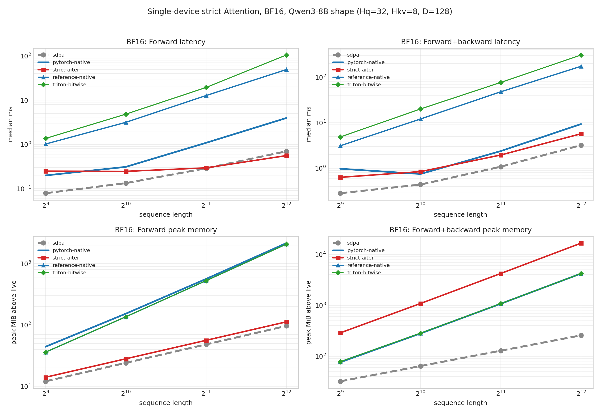
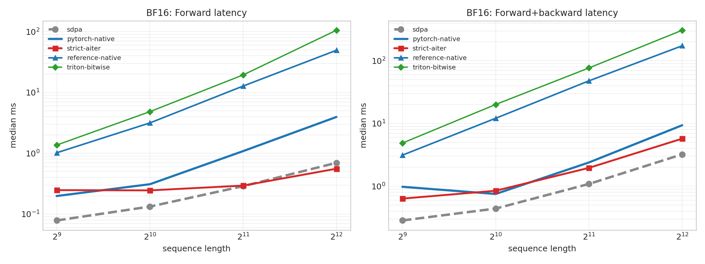
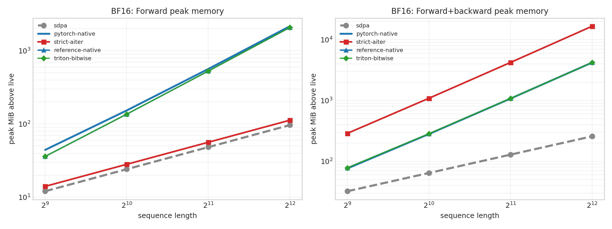
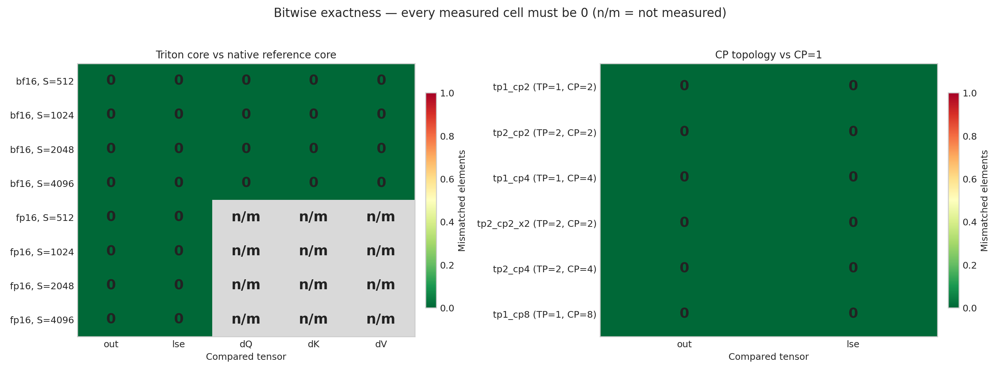
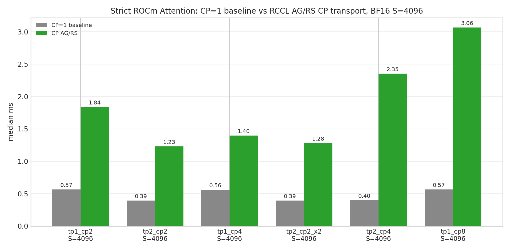

# WS2 strict ROCm Attention — bitwise parity and performance

> Operator-only benchmark. No model checkpoint or serving engine was used;
> the shapes are Qwen3-8B's attention shapes.

## Environment

| Item | mi300x |
|---|---|
| architecture | gfx942:sramecc+:xnack- |
| cpu_count | 192 |
| cuda | None |
| extension_attention_symbols | deterministic_attention_backward, deterministic_attention_forward |
| gpu | AMD Instinct MI300X |
| gpu_count | 8 |
| hip | 7.14.60850 |
| native_collective | torch.distributed ProcessGroupNCCL (RCCL on ROCm) |
| python | 3.12.3 |
| torch | 2.12.0+rocm7.14.0a20260608 |
| torch_threads | 4 |
| triton | 3.7.0 |

## Methodology

- Operator shape: `Hq=32`, `Hkv=8`, `D=128`, `B=1`, causal; sequence sweep 512, 1024, 2048, 4096.
- Measured paths:
  - `sdpa`: `torch.nn.functional.scaled_dot_product_attention`. **Speed baseline only** — as in PR #325, no accuracy comparison is mixed into the speed table.
  - `strict-aiter`: `StrictRocmAiterCKAttentionCore` called **once for all heads**. This is the core, not the production schedule: the Vime provider launches it once per (batch row, KV group). See the per-KV-group schedule table for that cost.
  - `reference-native`: `_C.deterministic_attention_forward/backward`, the materializing FP32 reference core hipified from the shared `.cu`.
  - `triton-bitwise`: `TritonDeterministicAttentionOp`, whose contract is bit-identity with `reference-native`.
- Timing: CUDA events, median and p95. Peak memory is the per-call increase in `torch.cuda.max_memory_allocated` above what was live before the call.
- Accuracy is against an FP64 oracle over the same BF16/FP16-rounded inputs. Repeat = two identical calls are bitwise equal; batch-invariant = a row computed alone is bitwise equal to the same row inside a batch.
- 5 warmups, 20 measured forward samples, 10 measured forward+backward samples. Raw medians, p95, min and max are in `results.json`.

Reproduce from the repository root:

```bash
python benchmarks/benchmark_ws2_rocm_attention.py \
  --seq-lens 512,1024,2048,4096 \
  --dtypes bf16,fp16 \
  --warmup 5 --samples 20 \
  --training-samples 10 \
  --output-dir benchmarks/results/ws2_rocm_mi300x
```

### Unavailable paths

- `strict-fa4`: CUDA-only path; this run is ROCm

## Bitwise parity: Triton port vs the native reference core

Acceptance is 0 mismatched elements. This is the contract the Triton core exists to hold.

| dtype | S | out mismatched | lse mismatched | dQ | dK | dV | bitwise |
|---|---:|---:|---:|---:|---:|---:|:---:|
| bf16 | 512 | 0 | 0 | 0 | 0 | 0 | yes |
| bf16 | 1024 | 0 | 0 | 0 | 0 | 0 | yes |
| bf16 | 2048 | 0 | 0 | 0 | 0 | 0 | yes |
| bf16 | 4096 | 0 | 0 | 0 | 0 | 0 | yes |
| fp16 | 512 | 0 | 0 | n/a | n/a | n/a | yes |
| fp16 | 1024 | 0 | 0 | n/a | n/a | n/a | yes |
| fp16 | 2048 | 0 | 0 | n/a | n/a | n/a | yes |
| fp16 | 4096 | 0 | 0 | n/a | n/a | n/a | yes |

`dQ/dK/dV` are measured on the BF16 sweep only; `n/a` marks the FP16 rows.

## Single-device Attention (bf16)

### Forward

| S | Path | Median (ms) | p95 (ms) | vs sdpa | Peak MiB | out max-abs vs FP64 | lse max-abs vs FP64 | Repeat |
|---:|---|---:|---:|---:|---:|---:|---:|:---:|
| 512 | sdpa | 0.0785 | 0.0843 | 1.00x | 12.1 | 8.195e-03 | n/a | yes |
| 512 | pytorch-native | 0.1981 | 0.3121 | 2.52x | 44.2 | 1.391e-02 | n/a | yes |
| 512 | strict-aiter | 0.2475 | 0.2714 | 3.15x | 14.1 | 2.468e-02 | 8.359e-07 | yes |
| 512 | reference-native | 1.0180 | 1.0542 | 12.97x | 36.1 | 7.741e-03 | 8.111e-07 | yes |
| 512 | triton-bitwise | 1.3627 | 1.3866 | 17.36x | 36.1 | 7.741e-03 | 8.111e-07 | yes |
| 1024 | sdpa | 0.1327 | 0.1440 | 1.00x | 24.1 | 1.027e-02 | n/a | yes |
| 1024 | pytorch-native | 0.3096 | 0.3200 | 2.33x | 153.0 | 1.571e-02 | n/a | yes |
| 1024 | strict-aiter | 0.2451 | 0.2578 | 1.85x | 28.1 | 2.609e-02 | 1.213e-06 | yes |
| 1024 | reference-native | 3.1537 | 3.8402 | 23.77x | 136.1 | 7.810e-03 | 8.732e-07 | yes |
| 1024 | triton-bitwise | 4.8326 | 4.8614 | 36.42x | 136.1 | 7.810e-03 | 8.732e-07 | yes |
| 2048 | sdpa | 0.2875 | 0.3083 | 1.00x | 48.3 | 7.994e-03 | n/a | yes |
| 2048 | pytorch-native | 1.0848 | 1.1129 | 3.77x | 564.0 | 1.803e-02 | n/a | yes |
| 2048 | strict-aiter | 0.2938 | 0.3060 | 1.02x | 56.3 | 2.027e-02 | 2.288e-06 | yes |
| 2048 | reference-native | 12.7428 | 12.9149 | 44.32x | 528.2 | 7.804e-03 | 1.142e-06 | yes |
| 2048 | triton-bitwise | 19.4210 | 19.5038 | 67.55x | 528.3 | 7.804e-03 | 1.142e-06 | yes |
| 4096 | sdpa | 0.6965 | 0.7457 | 1.00x | 96.5 | 9.604e-03 | n/a | yes |
| 4096 | pytorch-native | 3.9513 | 4.2331 | 5.67x | 2160.0 | 1.398e-02 | n/a | yes |
| 4096 | strict-aiter | 0.5569 | 0.5848 | 0.80x | 112.5 | 2.138e-02 | 3.967e-06 | yes |
| 4096 | reference-native | 49.3536 | 49.4533 | 70.86x | 2080.5 | 7.808e-03 | 1.381e-06 | yes |
| 4096 | triton-bitwise | 105.4049 | 110.6211 | 151.34x | 2080.5 | 7.808e-03 | 1.381e-06 | yes |

### Forward+backward

| S | Path | Median (ms) | p95 (ms) | vs sdpa | Peak MiB |
|---:|---|---:|---:|---:|---:|
| 512 | sdpa | 0.2836 | 0.5891 | 1.00x | 32.2 |
| 512 | pytorch-native | 0.9766 | 1.0728 | 3.44x | 76.3 |
| 512 | strict-aiter | 0.6328 | 0.6556 | 2.23x | 288.2 |
| 512 | reference-native | 3.1217 | 3.1910 | 11.01x | 78.1 |
| 512 | triton-bitwise | 4.8656 | 4.9558 | 17.15x | 78.1 |
| 1024 | sdpa | 0.4391 | 0.4822 | 1.00x | 64.3 |
| 1024 | pytorch-native | 0.7501 | 0.8035 | 1.71x | 281.0 |
| 1024 | strict-aiter | 0.8448 | 0.9276 | 1.92x | 1088.4 |
| 1024 | reference-native | 12.0942 | 12.2326 | 27.54x | 284.3 |
| 1024 | triton-bitwise | 20.0742 | 20.2126 | 45.72x | 284.3 |
| 2048 | sdpa | 1.0837 | 1.1348 | 1.00x | 128.8 |
| 2048 | pytorch-native | 2.3871 | 2.4252 | 2.20x | 1076.0 |
| 2048 | strict-aiter | 1.9570 | 2.0058 | 1.81x | 4224.8 |
| 2048 | reference-native | 47.8157 | 48.0608 | 44.12x | 1080.5 |
| 2048 | triton-bitwise | 76.7789 | 77.9824 | 70.85x | 1080.5 |
| 4096 | sdpa | 3.2163 | 3.3038 | 1.00x | 257.5 |
| 4096 | pytorch-native | 9.3608 | 9.4943 | 2.91x | 4208.0 |
| 4096 | strict-aiter | 5.7263 | 5.8219 | 1.78x | 16641.5 |
| 4096 | reference-native | 173.3246 | 177.7302 | 53.89x | 4209.0 |
| 4096 | triton-bitwise | 306.5966 | 346.2128 | 95.33x | 4209.0 |

## Single-device Attention (fp16)

### Forward

| S | Path | Median (ms) | p95 (ms) | vs sdpa | Peak MiB | out max-abs vs FP64 | lse max-abs vs FP64 | Repeat |
|---:|---|---:|---:|---:|---:|---:|---:|:---:|
| 512 | sdpa | 0.0703 | 0.1083 | 1.00x | 12.1 | 1.042e-03 | n/a | yes |
| 512 | pytorch-native | 0.1926 | 0.2989 | 2.74x | 44.2 | 1.811e-03 | n/a | yes |
| 512 | strict-aiter | 0.2729 | 0.2851 | 3.88x | 14.1 | 2.046e-03 | 8.756e-07 | yes |
| 512 | reference-native | 0.9919 | 1.0175 | 14.12x | 36.1 | 9.702e-04 | 8.340e-07 | yes |
| 512 | triton-bitwise | 1.3618 | 1.4008 | 19.38x | 36.1 | 9.702e-04 | 8.340e-07 | yes |
| 1024 | sdpa | 0.1264 | 0.1373 | 1.00x | 24.1 | 1.053e-03 | n/a | yes |
| 1024 | pytorch-native | 0.3178 | 0.3455 | 2.51x | 153.0 | 2.487e-03 | n/a | yes |
| 1024 | strict-aiter | 0.2891 | 0.3381 | 2.29x | 28.1 | 2.299e-03 | 1.250e-06 | yes |
| 1024 | reference-native | 3.0663 | 3.0975 | 24.26x | 136.1 | 9.757e-04 | 1.011e-06 | yes |
| 1024 | triton-bitwise | 4.7755 | 4.8063 | 37.78x | 136.1 | 9.757e-04 | 1.011e-06 | yes |
| 2048 | sdpa | 0.2897 | 0.2998 | 1.00x | 48.3 | 9.099e-04 | n/a | yes |
| 2048 | pytorch-native | 1.0828 | 1.1133 | 3.74x | 564.0 | 1.727e-03 | n/a | yes |
| 2048 | strict-aiter | 0.2991 | 0.3337 | 1.03x | 56.3 | 2.053e-03 | 2.540e-06 | yes |
| 2048 | reference-native | 12.5615 | 12.6840 | 43.36x | 528.2 | 9.099e-04 | 1.103e-06 | yes |
| 2048 | triton-bitwise | 19.2360 | 19.3075 | 66.40x | 528.3 | 9.099e-04 | 1.103e-06 | yes |
| 4096 | sdpa | 1.0774 | 1.1026 | 1.00x | 96.5 | 9.905e-04 | n/a | yes |
| 4096 | pytorch-native | 3.9607 | 4.2144 | 3.68x | 2160.0 | 2.339e-03 | n/a | yes |
| 4096 | strict-aiter | 0.5825 | 0.6701 | 0.54x | 112.5 | 1.953e-03 | 3.805e-06 | yes |
| 4096 | reference-native | 48.5714 | 48.6788 | 45.08x | 2080.5 | 9.681e-04 | 1.511e-06 | yes |
| 4096 | triton-bitwise | 84.3475 | 86.5872 | 78.29x | 2080.5 | 9.681e-04 | 1.511e-06 | yes |

### Forward+backward

| S | Path | Median (ms) | p95 (ms) | vs sdpa | Peak MiB |
|---:|---|---:|---:|---:|---:|
| 512 | sdpa | 0.3330 | 0.3590 | 1.00x | 32.2 |
| 512 | pytorch-native | 0.9847 | 1.0736 | 2.96x | 76.3 |
| 512 | strict-aiter | 1.1291 | 1.5507 | 3.39x | 288.2 |
| 512 | reference-native | 3.0893 | 3.1265 | 9.28x | 78.1 |
| 512 | triton-bitwise | 4.7979 | 4.8599 | 14.41x | 78.1 |
| 1024 | sdpa | 0.4161 | 0.4702 | 1.00x | 64.4 |
| 1024 | pytorch-native | 0.7710 | 0.8476 | 1.85x | 281.0 |
| 1024 | strict-aiter | 0.8597 | 0.9174 | 2.07x | 1088.4 |
| 1024 | reference-native | 11.8471 | 11.9334 | 28.47x | 284.3 |
| 1024 | triton-bitwise | 19.5915 | 19.7842 | 47.09x | 284.3 |
| 2048 | sdpa | 1.1873 | 1.5985 | 1.00x | 128.5 |
| 2048 | pytorch-native | 2.3897 | 2.9295 | 2.01x | 1076.0 |
| 2048 | strict-aiter | 1.7668 | 1.7958 | 1.49x | 4224.8 |
| 2048 | reference-native | 47.4088 | 47.5834 | 39.93x | 1080.5 |
| 2048 | triton-bitwise | 75.9789 | 76.2766 | 63.99x | 1080.5 |
| 4096 | sdpa | 3.9710 | 4.0939 | 1.00x | 257.0 |
| 4096 | pytorch-native | 9.4752 | 9.7886 | 2.39x | 4208.0 |
| 4096 | strict-aiter | 5.9360 | 5.9734 | 1.49x | 16641.5 |
| 4096 | reference-native | 171.5709 | 171.7084 | 43.21x | 4209.0 |
| 4096 | triton-bitwise | 301.2615 | 302.5984 | 75.87x | 4209.0 |

## Production core versus the reference core

These are two different kernels, so this is a tolerance comparison, not a parity claim. It is here to size the gap, not to assert equality.

| dtype | S | out max-abs | out relative-L2 | lse max-abs |
|---|---:|---:|---:|---:|
| bf16 | 512 | 3.125e-02 | 5.420e-03 | 9.537e-07 |
| bf16 | 1024 | 3.125e-02 | 5.505e-03 | 1.431e-06 |
| bf16 | 2048 | 1.562e-02 | 5.595e-03 | 1.907e-06 |
| bf16 | 4096 | 1.562e-02 | 5.633e-03 | 3.815e-06 |
| fp16 | 512 | 1.953e-03 | 4.323e-04 | 9.537e-07 |
| fp16 | 1024 | 1.953e-03 | 4.466e-04 | 1.431e-06 |
| fp16 | 2048 | 1.953e-03 | 4.503e-04 | 2.861e-06 |
| fp16 | 4096 | 1.953e-03 | 4.580e-04 | 3.815e-06 |

## Batch-composition invariance

A row computed alone must be bitwise equal to the same row inside a batch. The strict ROCm core rejects `B > 1` outright, so for that path the property is structural rather than measured.

| S | Path | Bitwise | Mismatched | Note |
|---:|---|:---:|---:|---|
| 512 | sdpa | yes | 0 | measured |
| 512 | pytorch-native | yes | 0 | measured |
| 512 | strict-aiter | yes | 0 | core executes one logical batch row per launch |
| 512 | reference-native | yes | 0 | measured |
| 512 | triton-bitwise | yes | 0 | measured |
| 1024 | sdpa | yes | 0 | measured |
| 1024 | pytorch-native | yes | 0 | measured |
| 1024 | strict-aiter | yes | 0 | core executes one logical batch row per launch |
| 1024 | reference-native | yes | 0 | measured |
| 1024 | triton-bitwise | yes | 0 | measured |
| 2048 | sdpa | yes | 0 | measured |
| 2048 | pytorch-native | yes | 0 | measured |
| 2048 | strict-aiter | yes | 0 | core executes one logical batch row per launch |
| 2048 | reference-native | yes | 0 | measured |
| 2048 | triton-bitwise | yes | 0 | measured |
| 4096 | sdpa | yes | 0 | measured |
| 4096 | pytorch-native | yes | 0 | measured |
| 4096 | strict-aiter | yes | 0 | core executes one logical batch row per launch |
| 4096 | reference-native | yes | 0 | measured |
| 4096 | triton-bitwise | yes | 0 | measured |

## TP-degree invariance of the strict ROCm core

A head shard computed under TP=N versus the same slice of an unsharded run. TP performs no cross-rank reduction in attention, so any nonzero value means the kernel's result depends on how many heads shared the launch. `raw_launch` is one launch for all heads; `one_kv_group_per_launch` is the schedule the Vime provider actually uses.

| S | Schedule | TP | Local Hq | Local Hkv | out max-abs | lse max-abs | Invariant |
|---:|---|---:|---:|---:|---:|---:|:---:|
| 512 | raw_launch | 2 | 16 | 4 | 0.000000e+00 | 0.000000e+00 | yes |
| 512 | raw_launch | 4 | 8 | 2 | 0.000000e+00 | 0.000000e+00 | yes |
| 512 | raw_launch | 8 | 4 | 1 | 0.000000e+00 | 0.000000e+00 | yes |
| 512 | one_kv_group_per_launch | 2 | 16 | 4 | 0.000000e+00 | 0.000000e+00 | yes |
| 512 | one_kv_group_per_launch | 4 | 8 | 2 | 0.000000e+00 | 0.000000e+00 | yes |
| 512 | one_kv_group_per_launch | 8 | 4 | 1 | 0.000000e+00 | 0.000000e+00 | yes |
| 1024 | raw_launch | 2 | 16 | 4 | 7.812500e-03 | 1.907349e-06 | **no** |
| 1024 | raw_launch | 4 | 8 | 2 | 7.812500e-03 | 1.907349e-06 | **no** |
| 1024 | raw_launch | 8 | 4 | 1 | 7.812500e-03 | 1.907349e-06 | **no** |
| 1024 | one_kv_group_per_launch | 2 | 16 | 4 | 0.000000e+00 | 0.000000e+00 | yes |
| 1024 | one_kv_group_per_launch | 4 | 8 | 2 | 0.000000e+00 | 0.000000e+00 | yes |
| 1024 | one_kv_group_per_launch | 8 | 4 | 1 | 0.000000e+00 | 0.000000e+00 | yes |
| 2048 | raw_launch | 2 | 16 | 4 | 0.000000e+00 | 0.000000e+00 | yes |
| 2048 | raw_launch | 4 | 8 | 2 | 3.906250e-03 | 2.861023e-06 | **no** |
| 2048 | raw_launch | 8 | 4 | 1 | 1.953125e-03 | 2.861023e-06 | **no** |
| 2048 | one_kv_group_per_launch | 2 | 16 | 4 | 0.000000e+00 | 0.000000e+00 | yes |
| 2048 | one_kv_group_per_launch | 4 | 8 | 2 | 0.000000e+00 | 0.000000e+00 | yes |
| 2048 | one_kv_group_per_launch | 8 | 4 | 1 | 0.000000e+00 | 0.000000e+00 | yes |
| 4096 | raw_launch | 2 | 16 | 4 | 0.000000e+00 | 0.000000e+00 | yes |
| 4096 | raw_launch | 4 | 8 | 2 | 0.000000e+00 | 0.000000e+00 | yes |
| 4096 | raw_launch | 8 | 4 | 1 | 3.906250e-03 | 4.768372e-06 | **no** |
| 4096 | one_kv_group_per_launch | 2 | 16 | 4 | 0.000000e+00 | 0.000000e+00 | yes |
| 4096 | one_kv_group_per_launch | 4 | 8 | 2 | 0.000000e+00 | 0.000000e+00 | yes |
| 4096 | one_kv_group_per_launch | 8 | 4 | 1 | 0.000000e+00 | 0.000000e+00 | yes |

## Cost of the per-KV-group launch schedule

§ TP-degree invariance is bought by launching the core once per `(batch row, KV group)` instead of once for all heads. This table is that bill. `raw_launch` is one launch for all heads and is **not** the production schedule; `per_kv_group` is what the Vime provider actually runs (`Hkv` launches per row).

| S | Launches | sdpa (ms) | raw_launch (ms) | per_kv_group (ms) | vs raw | vs sdpa |
|---:|---:|---:|---:|---:|---:|---:|
| 512 | 8 | 0.0712 | 0.2579 | 1.7759 | 6.89x | 24.95x |
| 1024 | 8 | 0.1302 | 0.2513 | 1.9985 | 7.95x | 15.35x |
| 2048 | 8 | 0.2802 | 0.2917 | 1.7507 | 6.00x | 6.25x |
| 4096 | 8 | 0.7046 | 0.5682 | 2.0472 | 3.60x | 2.91x |

## Distributed CP (RCCL AG/RS transport)

Schedule: all-gather Q/K/V and the position ids over the CP group, run the strict core once on the full sequence, reduce-scatter `(out, lse)` back to this rank's query range. Acceptance is bitwise against a CP=1 run of the same core.

| Topology | World | TP | CP | Replicas | S | Median (ms) | p95 (ms) | Peak MiB/rank | out bitwise | lse bitwise | Repeat |
|---|---:|---:|---:|---:|---:|---:|---:|---:|:---:|:---:|:---:|
| tp1_cp2 | 2 | 1 | 2 | 1 | 4096 | 1.8379 | 1.9000 | 160.5 | yes | yes | yes |
| tp2_cp2 | 4 | 2 | 2 | 1 | 4096 | 1.2288 | 1.2961 | 80.3 | yes | yes | yes |
| tp1_cp4 | 4 | 1 | 4 | 1 | 4096 | 1.3988 | 1.4461 | 160.5 | yes | yes | yes |
| tp2_cp2_x2 | 8 | 2 | 2 | 2 | 4096 | 1.2809 | 3.3578 | 80.3 | yes | yes | yes |
| tp2_cp4 | 8 | 2 | 4 | 1 | 4096 | 2.3537 | 6.9351 | 80.3 | yes | yes | yes |
| tp1_cp8 | 8 | 1 | 8 | 1 | 4096 | 3.0636 | 35.8611 | 160.5 | yes | yes | yes |

## Figures

`reference-native` and `triton-bitwise` allocate exactly the same buffers, so their memory curves coincide and the later-drawn series hides the earlier one.











